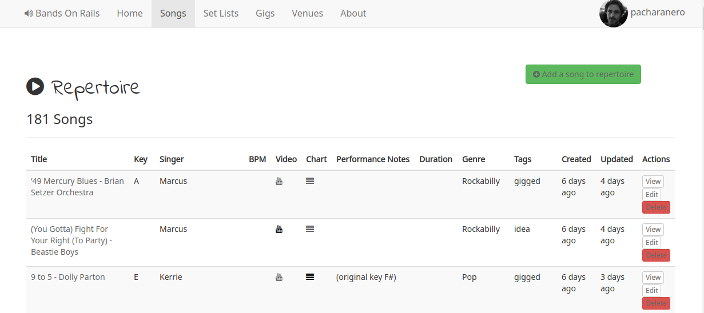

# Bands On Rails
An open source band management application in Rails

* Manage your Repertoire of Songs: Song charts/tab, YouTube links, with performance notes, BPM, duration, and tagging
* Collect songs together as ordered SetLists
* Create Gigs, with SetList, Venue, and even basic payment tracking
* Manage Venues with location, Google Maps links

## Worklist (features in active development)
### Done
* Basic user management with Devise
* (Very) rough CSV import for existing band repertoire (command line tool at this stage)
* Song model
* SetList model (SetLists `has_many` Songs)
* Venue model
* Gig model (gigs have a Venue and a SetList)
* Google Maps link for Venues
* Add Songs to a SetList
* humanize dates in listings

### To Do
* Copy a SetList to a new one
* Drag-and-drop to add Songs to a SetList
* Song search/filter in list
* Pick List for Song.key
* Tag handling for Songs, SetLists, Gigs, Venues etc
* Sidebar
* Google Maps embed
* bulk add songs to setlist (drag/drop)
* New song/venue/gig/setlist should happen in a modal
* equipment tracking
* band funds tracking

## Roadmap (features it would be nice to have but not currently planned)
* Performance Mode - steps through lyrics and charts in SetList order, displaying these as appropriate on mobile devices for the band, changing everyone's view simultaneously
* Practice Mode - highlights songs with least practice or not recently Gigged
* MarkDown based Song Editor instead of external links
* simple static 'Band pages' with gallery, booking info etc, so the band manager can function as your band website
* online band booking inquiry form
* Google Calendar integration (bookings/availability synced to shared calendar)
* Automatically create a YouTube Playlist from a SetList
* Manage recordings on a linked SoundCloud account

## Development Links
https://github.com/pcreux/csv-importer
https://github.com/seyhunak/twitter-bootstrap-rails
https://material.io/tools/icons/
https://fontawesome.com/v4.7.0/icons/
ngrok local log panel http://localhost:4040
mailcatcher
